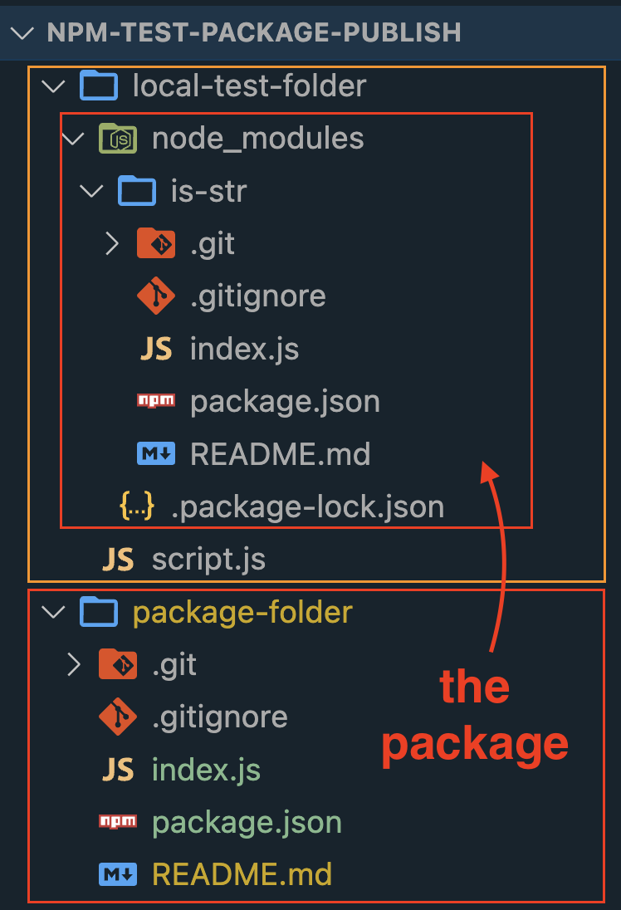

# My first 'pseudo' npm package

1. following **Kyle** from Web Dev Simplified: [link to the video](https://www.youtube.com/watch?v=J4b_T-qH3BY&ab_channel=WebDevSimplified)
2. creating this **README** file
3. creating **.gitignore** file via shell function I've installed
4. `git init` ... I want to start form my computer, Kyle first created a remote repo ... I'd like to use gh.
5. `git add` and `git commit`
6. using **gh** cli tool to create remote repo:
   `gh repo create is-str --public -s=. --push -d "I have tried to create my first npm package after testing it locally"`
7. gradually I'll hopefully make it work ... we will see :wink:
8. other steps ...
9. `npm init` ... creating **package.json** with some information about the package, the main is **index.js**
10. inserting a function in index.js

    ```js
    const isStr = (str) => {
      if (typeof str === "string") {
        return `Yes, it's a ${typeof str}.`;
      } else {
        return `No, it's not a string.`;
      }
    };

    module.exports = isStr;
    ```

    ... and we've got a package.

11. let's test it locally: `npm link` command in the package folder.
12. cd into the other folder that has been created for my local testing of the package.
13. creating a **script.js** file in which I am requiring the package and using it.

    ```js
    const isStr = require("is-str");

    console.log(isStr("hello"));
    console.log(isStr(12));
    console.log(isStr({ a: 23, b: "xy" }));
    console.log(isStr([1, "ddd"]));
    ```

14. by executing the command `npm link is-str` we create the folder **node_modules** in which we've got the access to the package's function and we can run the **script.js** file.
    
15. `node script.js` and it is working 👍.
